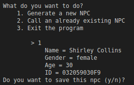

# Procedural NPC Generator Using CSV File As Storage
## Summary
This repository contains a Python program with which you can generate basic NPCs. The attributes of these NPCs are then encoded into a seed that can be used to reconstruct them if they have been saved priorly.

  

These seeds are created in a way that ensures their exclusivity, by adding the seed (which is the part used to rebuild the npc) and a number that increases per generation.

  

## TL;DR
**This program allows you to create npcs and store them in a csv file as encoded seeds, which you can later reconstruct.**
